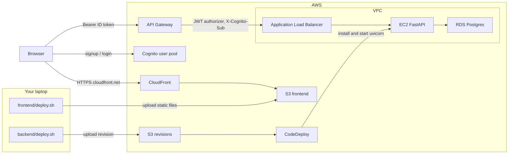
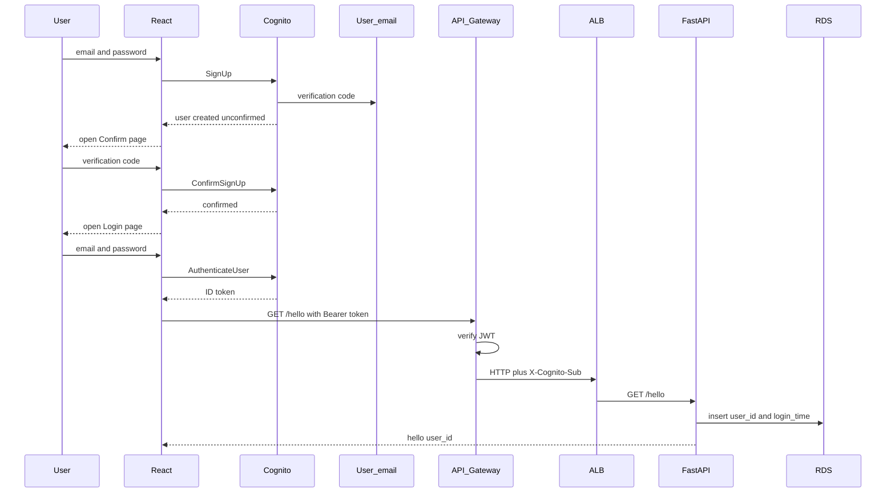

# User Management

Cognito authentication, a FastAPI API, and a React client. Provision AWS with Terraform, deploy FastAPI with CodeDeploy, and host the React app on S3 behind CloudFront (HTTPS `*.cloudfront.net`, no custom domain or ACM cert).



## Signup workflow

Sign up and confirm talk only to Cognito. API Gateway and FastAPI run after the user logs in.



## Prerequisites

- AWS CLI (`aws configure` — you do this yourself)
- Terraform >= 1.5
- Node.js 20+ (to build or run the React UI)

## 1. Provision infrastructure

`terraform apply` creates Cognito, API Gateway, the ALB, one EC2 instance, RDS, a CodeDeploy application, a revision bucket, a public S3 website bucket, and a CloudFront distribution for the React app. It does **not** start FastAPI or upload frontend files. CloudFront uses the default `*.cloudfront.net` certificate (no ACM). The first CloudFront deploy can take several minutes.

From `user-management/`:

```bash
cd terraform
cp terraform.tfvars.example terraform.tfvars   # edit aws_region if needed
terraform init
terraform apply
terraform output
```

| Output | Use |
|---|---|
| `api_gateway_url` | Frontend `VITE_API_URL` |
| `cognito_user_pool_id` | Frontend `VITE_COGNITO_USER_POOL_ID` |
| `cognito_app_client_id` | Frontend `VITE_COGNITO_CLIENT_ID` |
| `codedeploy_app` | Used by `backend/deploy.sh` |
| `codedeploy_bucket` | CodeDeploy revision store |
| `frontend_bucket` | Used by `frontend/deploy.sh` |
| `frontend_url` | Public S3 website URL (HTTP) |
| `frontend_cloudfront_url` | HTTPS CloudFront URL (open this in a browser) |
| `frontend_cloudfront_distribution_id` | Used by `frontend/deploy.sh` to invalidate cache |
| `aws_region` | Same region you applied in |

Wait a few minutes after apply so the instance installs the CodeDeploy agent.

## 2. Deploy FastAPI with CodeDeploy

From `user-management/`:

```bash
./backend/deploy.sh
```

That zips `backend/` (including `appspec.yml`), uploads a revision, and starts a CodeDeploy in-place deployment. The agent on EC2 copies the files, installs dependencies, and starts uvicorn.

Re-run the same script after API code changes. Do not run `terraform apply` just to ship app code.

The CodeDeploy S3 bucket is only the revision store. You do not SSH or copy files onto the VM yourself.

## 3. Run the UI on your laptop (optional)

```bash
cd frontend
cp .env.example .env
```

Set in `frontend/.env`:

```
VITE_COGNITO_USER_POOL_ID=<cognito_user_pool_id>
VITE_COGNITO_CLIENT_ID=<cognito_app_client_id>
VITE_API_URL=<api_gateway_url>
```

```bash
npm install
npm run dev
```

Open http://localhost:5173 and:

1. Sign up with email + password
2. Confirm the code Cognito emails you
3. Log in
4. Hello should show `hello <cognito user id>` and write a login row in RDS
5. Logins should list every stored `user_id` + `login_time`

## 4. Deploy the UI to S3

From `user-management/`:

```bash
./frontend/deploy.sh
```

The script reads Terraform outputs, builds the React app with those `VITE_*` values, syncs `frontend/dist/` to the public website bucket, and invalidates the CloudFront cache. Vite inlines the env vars at build time, so you must rebuild after API Gateway or Cognito values change.

Open the printed `frontend_cloudfront_url` (HTTPS, for example `https://d111111abcdef8.cloudfront.net`) and run the same checks as local:

1. Sign up with email + password
2. Confirm the code Cognito emails you
3. Log in
4. Hello should show `hello <cognito user id>` and write a login row in RDS
5. Logins should list every stored `user_id` + `login_time`

Refreshing `/login` or `/hello` is served as `index.html` (CloudFront custom error response, and the S3 website `error_document`). Re-run `./frontend/deploy.sh` after UI code changes.

The S3 website URL (`frontend_url`) still works over HTTP if you need it. There is no custom domain or ACM certificate yet.

## Endpoints (through API Gateway)

| Method | Path | Auth | Behavior |
|---|---|---|---|
| GET | `/health` | No (ALB only) | Load balancer health check |
| GET | `/hello` | Yes | Insert login row, return `hello <user_id>` |
| GET | `/logins` | Yes | All login rows, newest first |

API Gateway verifies the Cognito JWT and forwards the user id as `X-Cognito-Sub`.

## Tear down

```bash
cd terraform
terraform destroy
```

NAT Gateway, ALB, RDS, the EC2 instance, and CloudFront incur charges while the stack is up.
